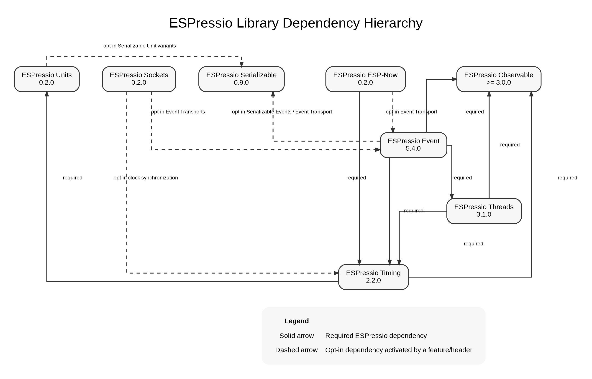

# ESPressio Dependency Chart



## ESPressio Threads 3.1.3

Threads has two required ESPressio dependencies:

```text
ESPressio Threads 3.1.3
    -> ESPressio Timing >= 2.2.3 < 3.0.0
    -> ESPressio Observable >= 3.0.1 < 4.0.0
```

Timing supplies the scheduling/time abstraction and carries its own required
Units dependency:

```text
Threads
    -> Timing 2.2.3
        -> Units 0.2.2
            - - -> Serializable 0.10.1
                   only when Serializable Unit types are selected
```

Threads therefore does **not** acquire a direct Serializable dependency.

## Current coordinated ecosystem

```text
FOUNDATIONAL
├── Observable 3.0.1
├── Serializable 0.10.1
├── Units 0.2.2
├── Security 0.2.0
└── Command 0.3.0

RUNTIME
└── Timing 2.2.3
    ├── Units >= 0.2.2 < 1.0.0
    └── Observable >= 3.0.1 < 4.0.0

EXECUTION
└── Threads 3.1.3
    ├── Timing >= 2.2.3 < 3.0.0
    └── Observable >= 3.0.1 < 4.0.0

TRANSPORT / EVENT
├── Sockets 0.5.0
├── ESP-Now 0.5.1
└── Event 5.8.1

DIAGNOSTICS / OPERATOR
└── Serial 0.5.1
```

## Downstream consumers

Event 5.8.1 consumes Threads 3.1.3 as a required dependency. Serial 0.5.1 may
consume Threads directly only through its opt-in diagnostic integration.

Threads itself remains independent of Event and Serial.

## Dependency-direction rule

Dependency changes cascade downstream. An upstream runtime library should not
depend back on a downstream integration merely to host adapter code.

The currently known reciprocal optional Event/ESP-Now relationship is an
architectural exception:

```text
ESP-Now - - -> Event
    ESPNowEventTransport

Event - - -> ESP-Now
    ESPNowTransportEventBridge
```

The preferred resolution is to keep Event upstream and transport-neutral and
move the ESP-Now-specific Observer-to-Event bridge downstream into ESP-Now's
Event integration (or a dedicated downstream integration package).

No new reciprocal dependency should be introduced.
