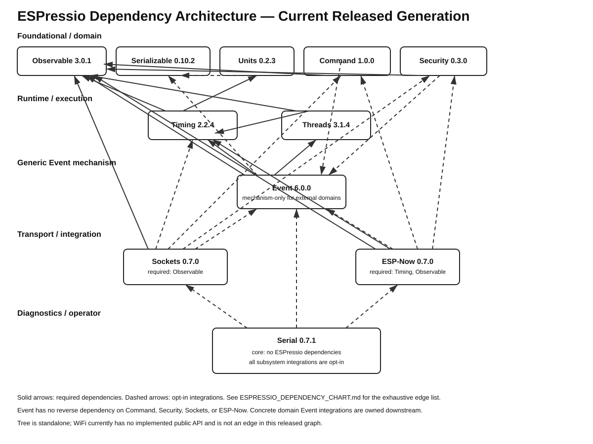

# ESPressio Dependency Chart



## ESPressio Threads 3.1.4

Threads has two required ESPressio dependencies:

```text
ESPressio Threads 3.1.4
    -> ESPressio Timing >= 2.2.4 < 3.0.0
    -> ESPressio Observable >= 3.0.1 < 4.0.0
```

Timing supplies the scheduling/time abstraction and carries its own required Units dependency. Threads therefore does **not** acquire a direct Serializable dependency.

## Current coordinated ecosystem

```text
FOUNDATIONAL
├── Observable 3.0.1
├── Serializable 0.10.2
├── Units 0.2.3
├── Security 0.3.0
└── Command 0.4.0

RUNTIME
└── Timing 2.2.4
    ├── Units >= 0.2.3 < 1.0.0
    └── Observable >= 3.0.1 < 4.0.0

EXECUTION
└── Threads 3.1.4
    ├── Timing >= 2.2.4 < 3.0.0
    └── Observable >= 3.0.1 < 4.0.0

EVENT
└── Event 6.0.0

TRANSPORT / INTEGRATION
├── Sockets 0.6.0
└── ESP-Now 0.6.0

DIAGNOSTICS / OPERATOR
└── Serial 0.6.0
```

## Downstream consumers

Event 6.0.0 consumes Threads 3.1.4 as a required dependency. Serial 0.6.0 may consume Threads directly only through its opt-in diagnostic integration.

Threads itself remains independent of Event and Serial.

## Dependency-direction rule

Dependency changes cascade downstream. Event 6.0.0 removed the former reverse dependencies on ESP-Now, Sockets, Command, and Security. Those domain libraries now own their concrete Event integrations:

```text
Command  - - -> Event
Security - - -> Event
Sockets  - - -> Event
ESP-Now  - - -> Event

Event -> Command   NONE
Event -> Security  NONE
Event -> Sockets   NONE
Event -> ESP-Now   NONE
```

Threads Event bridges intentionally remain in Event because Event already consumes Threads as part of its own runtime mechanism. Moving those bridges into Threads would introduce a reverse Threads -> Event dependency.

No reciprocal dependency should be introduced.
